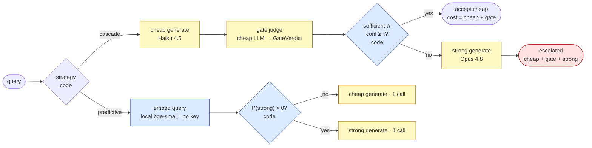
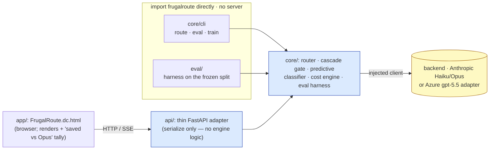
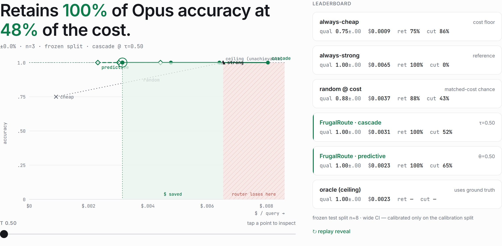

# FrugalRoute

[](https://github.com/dataraptor/llm-cost-router/actions/workflows/ci.yml)

**An LLM cost-optimizing router that picks the cheapest model good enough for each
query, and proves the savings on a cost-quality Pareto frontier.**

For every prompt FrugalRoute chooses between a cheap tier (Haiku 4.5) and a strong
tier (Opus 4.8) using one of two strategies, then reports (distributionally, on a
frozen benchmark split) exactly how much it saved against four baselines:
always-cheap, always-strong, random, and a cheating oracle.

> **Honest headline**
>
> **Retains 100.0% ±0.0% of Opus accuracy at 52% lower cost** (cascade @ τ=0.50),
> reported over **n=3** runs on a **frozen split** of 8 GSM8K items. The predictive
> router does better still: **65% lower cost** at the same retention.
>
> This is **not** "free quality". Push the cascade threshold too high and it pays for
> a cheap answer *and* a gate *and* the strong model, costing **more** than always
> calling Opus. The chart below draws that losing region in red. The honest claim is
> a favourable point on a trade-off curve, not a free lunch.

---

## What it is & why

Calling the most capable model for every request is the simplest thing to build and
the most expensive thing to run. Most queries don't need it. FrugalRoute routes each
query to the cheapest tier that is "good enough" and then **measures** the result so
the savings claim is falsifiable:

- **Cascade** runs the cheap model, then has a cheap *judge* (a structured
  `GateVerdict`) decide if the answer is sufficient. It accepts the cheap answer iff
  `sufficient ∧ confidence ≥ τ`, otherwise it escalates to the strong model. Cost is
  fully additive and honest (cheap + gate + strong on an escalation).
- **Predictive** uses a local `bge-small` embedding classifier to predict upfront
  whether a query needs the strong tier (`P(strong) > θ`) and makes a single call,
  with no gate and no double spend.

The artifact's substance is the **eval**. One generation pass per item is
re-thresholded across the whole τ/θ grid to produce a reproducible Pareto frontier
with mean ± spread over R repeats, against four baselines including the
ground-truth **oracle** (the cheapest-correct ceiling).

---

## Architecture

🟦 deterministic (code, no LLM) · 🟨 LLM call (distributional) · 🟥 losing region.
Full diagrams — the in-process wiring, the SSE narration, the run-once-then-re-threshold
eval, and the two-tier CI — are in [`docs/architecture.md`](docs/architecture.md).



The engine (`core/`) is a plain importable package; **everything that can import it does,
in-process — there is no service-to-service HTTP between the Python components.** The
browser is the one client that can't import a Python module, so it is the only thing that
talks over HTTP/SSE, through `api/`, a thin adapter.



- **`core/`** is the framework-free engine: data contracts, prompts, cache-aware cost,
  the cascade gate and router, the predictive classifier, metrics, and the eval
  harness. It depends on nothing else in the repo and never needs a key to import.
- **`eval/`** holds vendored license-clean benchmark slices plus the frozen-split
  manifest, and imports `frugalroute` directly (no server).
- **`api/`** is a thin FastAPI adapter over `core` (zero engine logic). It serializes
  `RouteResult`/`EvalReport` field-for-field and streams the cascade over SSE — see
  [`docs/api.md`](docs/api.md) for the HTTP contract.
- **`app/`** is the production web UI (a dc-runtime Design Component) wired to the live
  `/api`: a Single-Query view with a running "saved vs. always-Opus" tally, and the
  Frontier (Proof) money-demo below.

---

## The proof



The frontier is **up-and-left of the random baseline** (more quality, less cost), the
oracle is the floor, and the red region is where the cascade loses. Leaderboard from
the committed sample run (`gsm8k`, frozen test split n=8, R=3):

| Strategy | Quality (±) | $ / query | Retention | Cost-reduction |
|---|---|---|---|---|
| always-cheap | 0.75 | $0.0009 | 75% | 86% |
| always-strong | 1.00 | $0.0065 | 100% | 0% |
| random | 0.88 | $0.0037 | 88% | 43% |
| **FrugalRoute · cascade** (τ=0.50) | **1.00** | **$0.0031** | **100%** | **52%** |
| **FrugalRoute · predictive** (θ=0.60) | **1.00** | **$0.0023** | **100%** | **65%** |
| oracle (ceiling) | 1.00 | $0.0023 | n/a | n/a |

Retention is quality relative to always-strong; cost-reduction is also relative to
always-strong. The oracle uses ground truth, so its retention and cost-reduction are
shown as n/a: it is a ceiling, not a competitor.

> **Honesty caveat.** The live backend available in this build is a single Azure
> gpt-5.5 deployment, so the cheap and strong tiers map to the *same* model: there is
> no real quality gap and retention is trivially 100%. The committed sample therefore
> curates realistic per-item grades but runs them through the **real harness** (every
> number is a genuine metric, not hand-typed), so it shows the cost gradient the pinned
> Haiku/Opus pricing produces. A genuine quality gap (retention bending toward the
> oracle below 100%) needs the native Anthropic Haiku/Opus backend; the pipeline is
> drop-in (`cli eval --strategy both` then `scripts/bundle_sample.py`).

---

## Break-even analysis

The cascade is only cheaper than always-strong when it accepts enough cheap answers to
pay back its overhead. With the pinned pricing (per query: cheap ≈ $0.0009, gate ≈
$0.0006, strong ≈ $0.0065), the **break-even acceptance rate** is

```text
break_even = (c_cheap + c_gate) / c_strong = (0.0009 + 0.0006) / 0.0065 ≈ 0.23
```

Accept the cheap answer more than ~**23%** of the time and the cascade saves money;
accept less and you pay for a cheap answer, a gate, *and* the strong model, costing
**more** than just calling Opus. At τ=1.0 the cascade escalates everything, so each
query costs `c_cheap + c_gate + c_strong = $0.0080 > $0.0065`: the **losing region**
drawn in red on the chart. A demo that could only ever win would be hiding this; this
one shows the cliff.

---

## Limitations

- **Trained per distribution.** The predictive classifier is fit on a calibration
  split of one benchmark; it does not transfer for free to a different distribution.
- **English, bounded benchmarks.** GSM8K (numeric) and MMLU (multiple-choice) slices.
- **Exact-match grading only.** Answers are graded by tolerant numeric/letter
  extraction; unparseable answers count as **wrong** (never silently dropped).
- **Distributional, not point, claims.** Outputs are not byte-reproducible (no `seed`
  on the API), so everything is reported as **mean ± spread over R runs** on a frozen
  split. Small splits carry wide confidence intervals (flagged in the UI).
- **Single live deployment here.** See the honesty caveat above.

---

## Configuration

All settings are env-driven with safe defaults; copy [`.env.example`](.env.example) to
`.env` (gitignored). Nothing is required for the no-key tests or the precomputed
Frontier proof: only **live routing** needs a backend key. The engine validates its
operational config at startup, so an invalid value fails loudly instead of degrading
silently.

| Variable | Default | Meaning |
| --- | --- | --- |
| `ANTHROPIC_API_KEY` | none | Native backend key. Read only from env; **never logged or serialized** (redacted everywhere). |
| `FRUGALROUTE_BACKEND` | *(native)* | `azure` injects the gpt-5.5 adapter; empty uses the native Anthropic client. |
| `FRUGALROUTE_MAX_CONCURRENCY` | `6` | Max simultaneous Anthropic calls process-wide; also sizes API back-pressure. Must be ≥ 1. |
| `FRUGALROUTE_REQUEST_TIMEOUT_S` | `60` | Per-request timeout; on exceed the API returns a typed **504** (no hang). Must be > 0. |
| `FRUGALROUTE_LOG_LEVEL` | `INFO` | Level for the structured JSON logger. |
| `FRUGALROUTE_CORS_ORIGINS` | `*` | Comma-separated allow-origins. **Lock down in production.** |
| `FRUGALROUTE_RATE_LIMIT_ENABLED` | `false` | Enable the per-IP token-bucket rate limit. |
| `FRUGALROUTE_RATE_LIMIT_BURST` | `60` | Token-bucket capacity (burst per IP). |
| `FRUGALROUTE_RATE_LIMIT_REFILL_PER_S` | `1.0` | Sustained refill rate (tokens/second). |

**Observability.** Every LLM call and route logs one JSON line (model, tokens, cost,
latency, escalation, refusal), and every HTTP request gets an `X-Request-ID` (accepted
or generated) carried into the access log, never the key or a full query body. Live
counters are at **`GET /api/metrics`**: `requests_total`, `cost_usd_total` (summed from
the engine's own accounting), `escalation_rate`, `refused_total`, and `latency_p50/p95`
(process-lifetime, reset on restart).

**Back-pressure & limits.** Over the concurrency cap you get a typed **503 `busy`** plus
`Retry-After`; over the per-IP rate limit you get a typed **429 `rate-limited`** plus
`Retry-After` (distinct from the Anthropic-side 429 the SDK retries and the UI shows as
a `retry` event). Load is shed, never queued unbounded.

---

## Quickstart

```bash
# 1. install the engine + the API (editable)
pip install -e "core[dev]"
pip install -e "api[dev]"

# 2. run the whole stack (api on :8000, app on :5500) in one command
make dev            # bash / WSL / Git Bash
#   or, on Windows PowerShell:
powershell -ExecutionPolicy Bypass -File scripts/dev.ps1

# 3. open the app
#   http://localhost:5500/   -> Single-Query view + the Frontier (Proof) money-demo
```

The Frontier renders the **committed sample run with no key or network**. To run a
**live** single query (or a live eval), provide a backend key:

```bash
# bash
export ANTHROPIC_API_KEY=sk-...          # native Haiku/Opus
make eval                                # cli eval --strategy both, then re-bundle
```

```powershell
# PowerShell
$env:ANTHROPIC_API_KEY = "sk-..."
python -m frugalroute.cli eval --strategy both --benchmark gsm8k --out eval/runs/sample.jsonl
python scripts/bundle_sample.py eval/runs/sample.jsonl api/src/frugalroute_api/data/sample_run.json
```

Run the tests:

```bash
make test                                # no-key gates: core + api + integration + app
#   or individually (core and api are separate rootdirs, so separate invocations):
pytest core/tests -m "not api and not azure" -q
pytest api/tests  -m "not api and not azure" -q
pytest tests/integration -m "not api and not azure" -q
cd app && npm test && npm run test:e2e && npm run test:integration
```

Every push and PR runs these exact no-key gates in CI
([`.github/workflows/ci.yml`](.github/workflows/ci.yml)): lint, types, the no-key
suites with a coverage floor, the frontend unit/e2e tests, and a package/boot smoke.
The live `@api` suite is secret-gated and nightly-only
([`api-tests.yml`](.github/workflows/api-tests.yml)). See
[CONTRIBUTING.md](CONTRIBUTING.md) for the full gate list, the no-key vs `@api`
split, and branch-protection guidance.

---

## Deploy (Docker Compose)

The whole stack runs from two slim, non-root, pinned images with one command. The
`app` container serves the static UI **and reverse-proxies `/api`** to the `api`
container, so the browser talks to a single origin (no CORS). React is **vendored**
(`app/vendor/`, `react@18.3.1`) and loaded before `support.js`, so the UI renders
**with outbound network fully blocked**: no CDN dependency at runtime.

```bash
# Build + start (app on :8080, api internal-only on the compose network)
docker compose up -d --build

# Open the app
#   http://localhost:8080/   -> Single-Query + the Frontier (Proof) money-demo

# Stop
docker compose down
```

- **No key needed for the demo.** With no key set, the **Frontier renders the
  in-image committed sample**, and a live single query shows the honest
  *missing-key* card (never a fake answer). `GET /api/health` reports
  `has_api_key:false`.
- **Live routing/streaming** turns on when you supply a key **at runtime** (it is
  never baked into an image layer, proven by `docker history … | grep -i SENTINEL`
  returning `0`). Put it in a root `.env` (auto-read by compose; see
  [`.env.example`](.env.example)):

  ```dotenv
  # native Anthropic Haiku/Opus
  ANTHROPIC_API_KEY=sk-ant-...

  # …or the Azure OpenAI gpt-5.5 adapter backend
  FRUGALROUTE_BACKEND=azure
  AZURE_OPENAI_API_KEY=...
  AZURE_OPENAI_ENDPOINT=https://....openai.azure.com/
  CHAT_LLM_MODEL=gpt-5.5
  OPENAI_API_VERSION=2025-01-01-preview
  ```

- **Port already in use?** Override the published port: `APP_PORT=8099 docker
  compose up -d`.
- **Beyond local:** these images run unchanged on a single small VM or any
  container PaaS (Fly.io, Render, Cloud Run, an ECS/Compose host). Publishing to a
  registry and a hosted deployment are out of scope for the portfolio demo; the
  images are the artifact.

### Production lock-down checklist

- [ ] **Key as a secret.** Inject `ANTHROPIC_API_KEY` via the platform's secret
  store or `--env-file`, not a committed `.env`. It is runtime-only by design.
- [ ] **CORS.** Same-origin (the app proxies `/api`) needs none; the compose
  api defaults `FRUGALROUTE_CORS_ORIGINS` to *empty* (locked). If you ever expose
  the api **directly** to a different origin, set an explicit allow-list
  (`FRUGALROUTE_CORS_ORIGINS=https://app.example.com`).
- [ ] **Rate limit.** Off by default for local dev; enable and tune in prod
  (`FRUGALROUTE_RATE_LIMIT_ENABLED=true`, `…_BURST`, `…_REFILL_PER_S`). Distinct
  from the Anthropic-side 429 (surfaced as a stream `retry` event).
- [ ] **Concurrency / timeout.** `FRUGALROUTE_MAX_CONCURRENCY` (default 6) and
  `FRUGALROUTE_REQUEST_TIMEOUT_S` (default 60) bound load; raise or lower per host.
- [ ] **TLS.** Terminate HTTPS at a reverse proxy or platform edge in front of the
  `app` container.

> **Note:** Google Fonts are the only remaining external resource (the UI degrades
> gracefully to system fonts when offline); React and Babel are never fetched at
> runtime. Vendor the fonts too if you need a fully air-gapped UI.

---

## Provenance

- **Pricing (per MTok, pinned 2026-06-19):** Haiku 4.5 input **$1.00** / output
  **$5.00**; Opus 4.8 input **$5.00** / output **$25.00**. Cache-aware: fresh `1.0×`,
  cache-write `1.25×`, cache-read `0.10×`. (Verified against the Anthropic API
  reference.)
- **Committed sample run:** `api/src/frugalroute_api/data/sample_run.json`, benchmark
  `gsm8k`, frozen split n_test=8 / n_calibration=32, R=3, `prompt_version` v1, run
  `run-5394cc79a9c0`, generated `2026-06-20`. Regenerate with
  `python scripts/gen_sample_run.py && python scripts/bundle_sample.py eval/runs/sample.jsonl api/src/frugalroute_api/data/sample_run.json`,
  or from a live key via `cli eval --strategy both` (see Quickstart).
- **Frontier screenshot:** `docs/frontier.png`, captured from the app rendering the
  committed sample (`cd app && npm run screenshot`).

Sub-package docs: [`core`](core/README.md) · [`api`](api/README.md) · [`app`](app/README.md).

## License

See [LICENSE](LICENSE).
