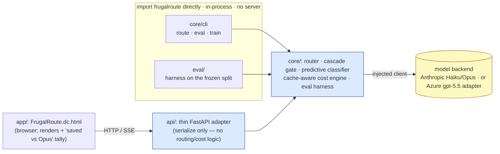
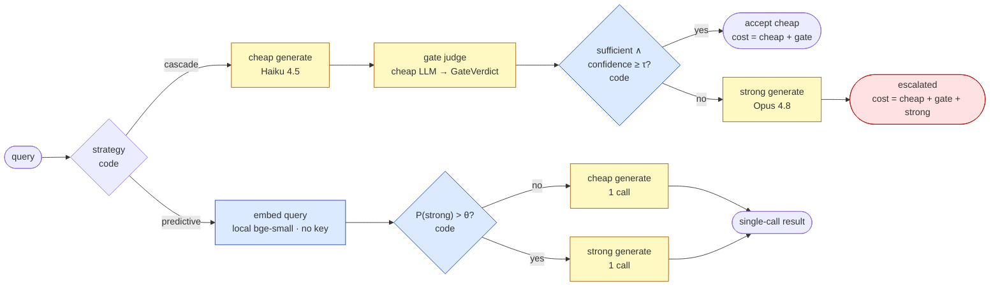
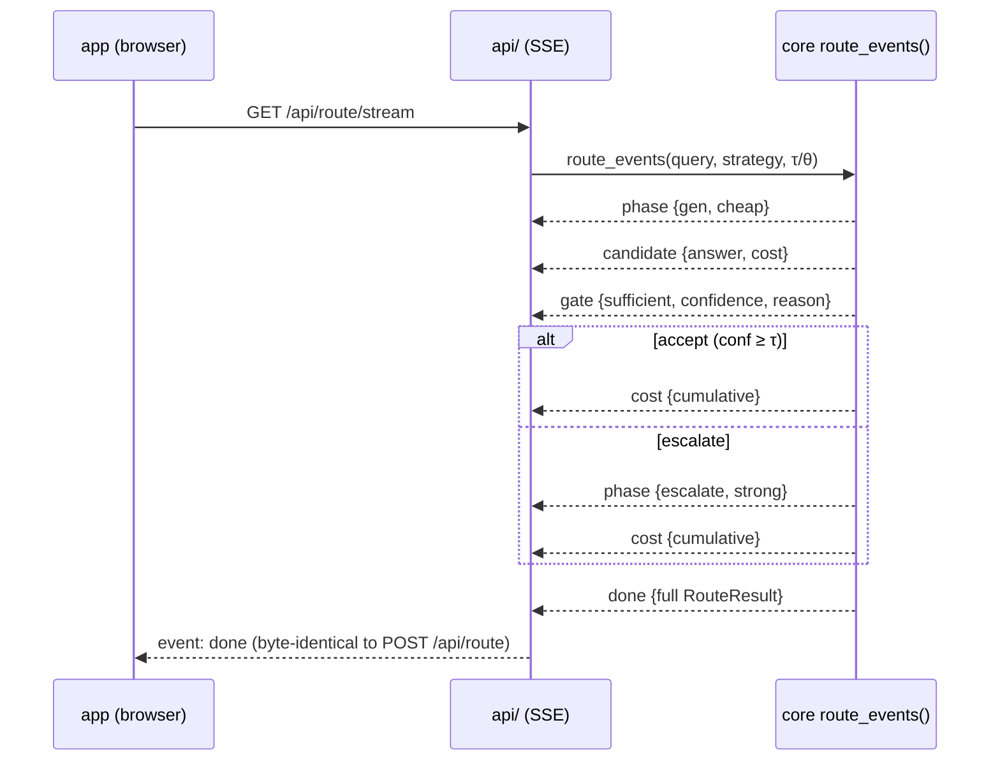
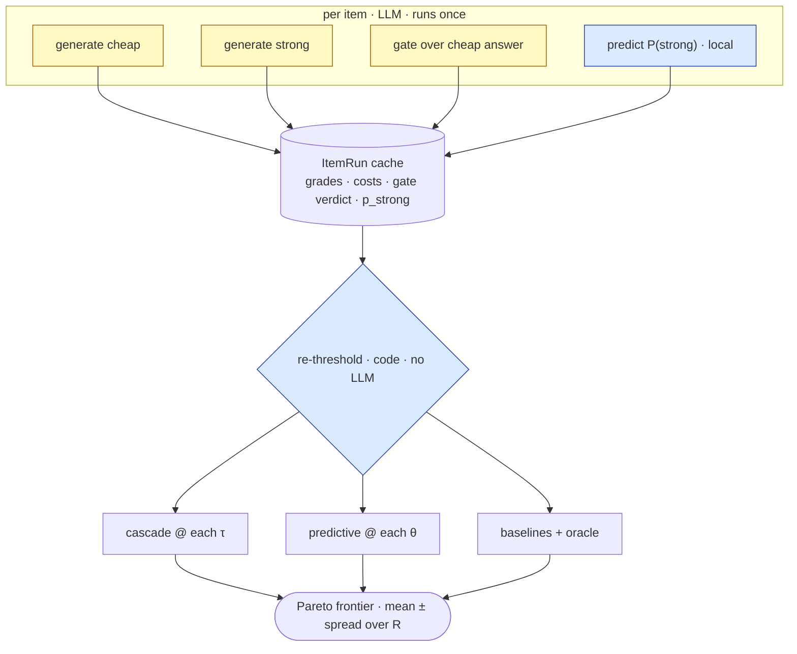
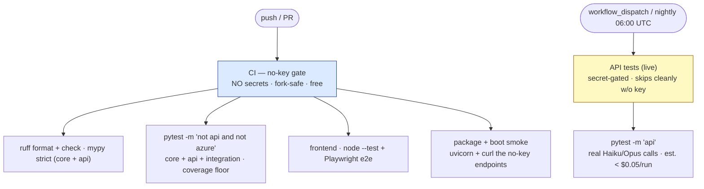

# Architecture

🟦 deterministic (code, no LLM) · 🟨 LLM call (distributional) · 🟥 losing region / honesty caveat.

FrugalRoute is a small, framework-free routing **engine** with three thin shells around
it (a CLI, an HTTP adapter, and a browser UI). The load-bearing design choice is the same
one twice: **keep every money-claim deterministic and keep the LLM strictly inside a box
you can re-threshold offline**, so the savings number on the chart is arithmetic over a
cached run, never a live API call you can't reproduce.

This document collects the full diagrams: the in-process wiring, the two routing
strategies, the SSE narration, the run-once-then-re-threshold eval, and the two-tier CI.
For the eval math (frontier, baselines, oracle, break-even) see
[`eval-methodology.md`](eval-methodology.md); for the HTTP contract see [`api.md`](api.md).

---

## In-process wiring

The orchestrator (`frugalroute`) is a plain importable package. **Everything that can
import it does, in-process. There is no service-to-service HTTP between the Python
components** — the browser is the one client that can't import a Python module, so it is
the only thing that talks over HTTP/SSE, through `api/`, a *thin adapter that only
reshapes what the engine already produced*.



- **`core/`** depends on nothing else in the repo. Importing it never needs a key — the
  Anthropic client is built lazily in `get_client()`, and the client is *injected* into
  every call, so the whole engine is unit-testable with a fake client and no network.
- **`eval/`** and **`core/cli`** import the engine directly. That in-process design is
  what makes eval runs isolated and reproducible: the harness drives generation/gating
  itself so it can cache and re-threshold (see below), rather than replaying a live path.
- **`api/`** is a thin adapter. It validates input, calls the engine in-process, and
  serializes `RouteResult`/`EvalReport` **field-for-field**. The "no routing/cost/metric
  logic in `api/`" rule is a real constraint — those numbers come from `core` only.
- **`app/`** is a dc-runtime Design Component wired to the live `/api`. It renders; it
  does not compute savings (the engine does).

---

## The two routing strategies

`route(query, strategy=…, tau=…, theta=…)` is the single public entry point. Both
strategies return the same `RouteResult` (tier used, escalated?, refused?, **fully
additive** `cost_usd`, latency). The cost is always the real sum of every call actually
made — there is no hidden accounting.



**Cascade** runs the cheap tier, then a cheap *judge* (a structured `GateVerdict`) decides
whether the cheap answer is good enough. It accepts the cheap answer **iff `sufficient ∧
confidence ≥ τ`**, otherwise escalates to the strong tier. Cost is additive and honest:
an escalation pays for the cheap answer *and* the gate *and* the strong model. This is
why pushing τ too high **loses** — drawn red above and analysed in
[`eval-methodology.md`](eval-methodology.md#break-even).

**Predictive** embeds the query with a local `bge-small` classifier (no key, no LLM) and
predicts upfront whether the query needs the strong tier (`P(strong) > θ`), then makes
**exactly one** model call — no gate, no cheap-then-strong double spend.

**Refusals never crash the path.** A cheap refusal escalates straight to strong (skipping
the gate); a gate refusal or unparseable verdict yields a conservative *escalate* verdict
(`sufficient=False, confidence=0`); a strong refusal is surfaced honestly (`refused=True`,
empty text) — never a fabricated answer.

---

## Streaming — one event per real boundary

`route()` is implemented by **draining** `route_events()`, so there is exactly one copy of
the routing logic and the streamed result can never diverge from the synchronous one (the
terminal `done` payload equals what `route()` returns for the same inputs). The events are
a presentation-layer narration of boundaries that already exist — one event per real call;
they add no routing behaviour. `api/` re-emits them over SSE.



Event types: `phase · candidate · gate · cost · retry · refusal · done`. The `done` body
is re-derived from the serialized `RouteResult`, so a streamed route and a `POST
/api/route` for the same inputs produce the **same** final payload.

---

## Eval — run once, then re-threshold

The artifact's substance is the eval, and its honesty hinges on one rule: for each item
the harness generates **each tier exactly once** and runs the cascade gate **exactly
once**, caches the per-item result, and then computes *every* frontier point as pure
arithmetic over that cache.



So the cost is `items × tiers × R` generations + `items × R` gate calls — **independent of
the grid size** — and no frontier point is confounded by per-call non-determinism (the
gate verdict is cached, it does not depend on τ). The live `route()` path is *not* used to
build the frontier; the harness drives generation/gating directly so it can cache and
re-threshold. The pure pieces (re-thresholding, aggregation, (de)serialization, rendering)
are no-key testable on synthetic caches. Full math in
[`eval-methodology.md`](eval-methodology.md).

---

## Two-tier CI — you cannot gate a commit on a live LLM number

The headline honesty mechanism is structural: the gate that blocks merges **makes no API
call at all**. Every metric that depends on the live backend lives in a separate,
secret-gated, nightly-only workflow that never blocks a PR.



- **[`ci.yml`](../.github/workflows/ci.yml)** runs on every push and PR, requires **no
  secrets** (so fork PRs pass end to end), and is exactly the commands each split's
  Definition of Done runs locally — green CI is, by construction, green local DoD.
- **[`api-tests.yml`](../.github/workflows/api-tests.yml)** is the expensive `@api` suite.
  It only runs on `workflow_dispatch` or the nightly cron, and a guard step skips it
  cleanly when `ANTHROPIC_API_KEY` is absent — so it can never block the gate.

---

## Cost engine (the one number everything else trusts)

`cost_usd(model_id, …)` is a pure, cache-aware, 3-bucket formula keyed by **pinned**
pricing (the cost gradient *is* the artifact, so an unknown model raises rather than
silently costing zero):

```
cost = input/1e6 · in_price
     + cache_write/1e6 · in_price · 1.25   (5-min TTL write)
     + cache_read/1e6  · in_price · 0.10   (cache read)
     + output/1e6 · out_price
```

Pinned per-MTok pricing (2026-06-19): **Haiku 4.5** in `$1.00` / out `$5.00`; **Opus 4.8**
in `$5.00` / out `$25.00`. Tiers are an *ordered, config-driven* list (`DEFAULT_TIERS =
[haiku, opus]`) — adding Sonnet between them is configuration, not a rewrite. Every live
call computes its cost from the response's real `usage`, and the engine accumulates those
sums; nothing in `api/` or `app/` recomputes money.
</content>
