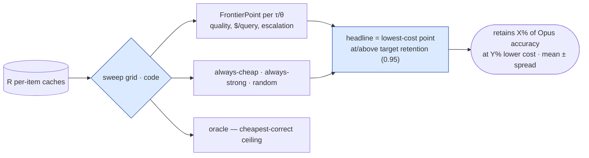
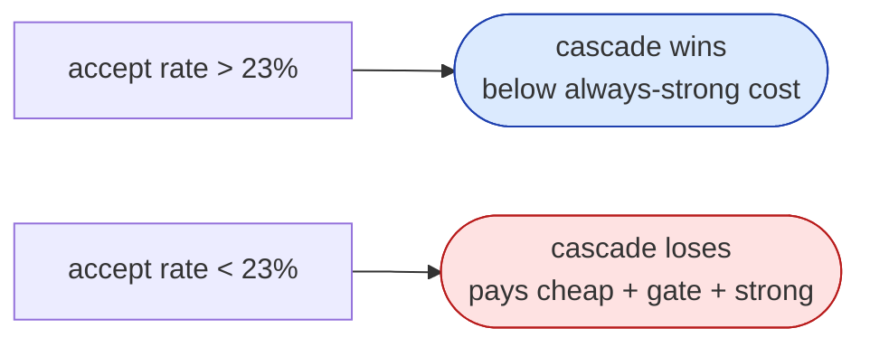

# Eval methodology

🟦 deterministic (code, no LLM) · 🟨 LLM call (distributional) · 🟥 losing region.

The savings claim is only worth as much as the eval behind it. This document is the math:
how one generation pass becomes a whole Pareto frontier, what the four baselines and the
oracle mean, why the headline is reported as **mean ± spread**, and where the cascade
actually *loses* money. The wiring that produces these numbers is in
[`architecture.md`](architecture.md#eval--run-once-then-re-threshold).

---

## Run once, then re-threshold

For each item on the frozen test split the harness does the live work **exactly once**:

| Step | Tier | Run | Cached as |
|---|---|---|---|
| generate cheap | Haiku 4.5 | once | grade, cost, refused |
| generate strong | Opus 4.8 | once | grade, cost, refused |
| gate the cheap answer | cheap judge | once | `sufficient`, `confidence`, cost |
| predict P(strong) | local `bge-small` | once | `p_strong` (no key) |

Everything after that is pure arithmetic over the cached `ItemRun`:

- **cascade @ τ** — accept iff `sufficient ∧ confidence ≥ τ` → cheap grade, `cost =
  c_cheap + c_gate`; else escalate → strong grade, `cost = c_cheap + c_gate + c_strong`.
  A cheap **refusal** escalates without a gate (`c_cheap + c_strong`).
- **predictive @ θ** — strong iff `p_strong > θ` else cheap → that tier's cached grade +
  cost (no gate, no double spend).

So the total live cost is `items × tiers × R` generations + `items × R` gate calls —
**independent of the grid size** — and the whole τ/θ sweep is re-thresholding, not
re-generation. The gate verdict is cached and does **not** depend on τ, so no two points
on the frontier are confounded by per-call non-determinism.

---

## The frontier, the baselines, the oracle

Every operating point and baseline is computed **per repeat**, then reported as **mean ±
population-stdev over the R repeats** (outputs are not byte-reproducible — there is no
`seed` on the API — so a point claim would be dishonest; small splits carry wide
intervals, flagged in the UI).

| Competitor | What it is |
|---|---|
| **always-cheap** | every query → Haiku. Cheapest, lowest quality. |
| **always-strong** | every query → Opus. The 100%-retention, full-cost reference. |
| **random** | coin-flip cheap/strong. The "no-skill" diagonal to beat. |
| **FrugalRoute · cascade** | cheap → gate → escalate. |
| **FrugalRoute · predictive** | classifier picks one tier upfront. |
| **oracle (ceiling)** | uses ground truth to pick the **cheapest-correct** tier per item. |



**Retention** is quality relative to always-strong; **cost-reduction** is cost relative to
always-strong. The oracle uses ground truth, so its retention/cost-reduction are shown as
`n/a` — it is a **ceiling, not a competitor**. The honest read of the chart: FrugalRoute's
frontier should sit **up-and-left of random** (more quality per dollar), with the oracle
as the unreachable floor on cost.

The headline is the **lowest-cost frontier point at or above the target retention**
(default 0.95), with its spread taken over the repeats at that same operating point. It is
phrased to never claim "free quality": *"retains X% of Opus accuracy at Y% lower cost (n=…,
frozen split, strategy @ param=…)."*

---

## Grading is objective and fail-closed

Answers are graded by tolerant, deterministic extraction — numeric tolerance for GSM8K,
letter match for MMLU. An **unparseable answer counts as wrong**, never silently dropped,
and a refusal grades as wrong (and is counted in `n_refused`). No LLM grades another LLM
on the gated path; the only judge in the loop is the cascade gate, whose verdict is itself
re-thresholded deterministically.

---

## Break-even

The cascade is cheaper than always-strong **only when it accepts enough cheap answers to
pay back its overhead**. With per-query costs cheap ≈ `$0.0009`, gate ≈ `$0.0006`, strong
≈ `$0.0065`, the break-even acceptance rate is:

```
break_even = (c_cheap + c_gate) / c_strong
           = (0.0009 + 0.0006) / 0.0065
           ≈ 0.23
```

Accept the cheap answer more than ~**23%** of the time and the cascade saves money. Accept
less and you pay for a cheap answer, a gate, *and* the strong model — costing **more** than
just calling Opus. At **τ = 1.0** the cascade escalates everything, so each query costs
`c_cheap + c_gate + c_strong = $0.0080 > $0.0065`: the **losing region** drawn red on the
chart and in the routing diagram. A demo that could only ever win would be hiding this
cliff; this one shows it.



---

## Honesty caveat — the single live deployment

The live backend in this build is a single Azure **gpt-5.5** deployment, so the cheap and
strong tiers map to the *same* model: there is no real quality gap and retention is
trivially 100%. The committed sample therefore curates realistic per-item grades but runs
them through the **real harness** (every number is a genuine metric, not hand-typed), so it
shows the cost gradient the pinned Haiku/Opus pricing produces. A genuine quality gap
(retention bending toward the oracle, below 100%) needs the native Anthropic Haiku/Opus
backend; the pipeline is drop-in:

```bash
export ANTHROPIC_API_KEY=sk-ant-...
python -m frugalroute.cli eval --strategy both --benchmark gsm8k --out eval/runs/sample.jsonl
python scripts/bundle_sample.py eval/runs/sample.jsonl api/src/frugalroute_api/data/sample_run.json
```

---

## Limitations

- **Trained per distribution.** The predictive classifier is fit on a calibration split of
  one benchmark; it does not transfer for free to a different distribution.
- **English, bounded benchmarks.** GSM8K (numeric) and MMLU (multiple-choice) slices.
- **Exact-match grading only.** Unparseable answers count as wrong (never dropped).
- **Distributional, not point, claims.** No `seed` on the API → mean ± spread over R runs
  on a frozen split; small splits carry wide intervals.
- **Single live deployment here.** See the caveat above.
</content>
